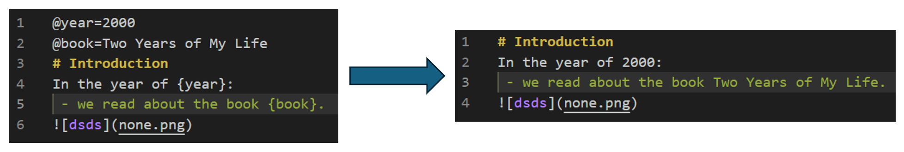

# Markdown Variabled
Custom markdown parser/syntax for inserting variables like Python format strings. 

# Quick Start
## Syntax
 - use the following grammar to define variables on separate new lines:
      - `@var=value`
 - reference your variables in text with brackets {}:
     - `the variable is {var}`
 - use `python parser.py <markdown file>` to parse variables and you get a brand new markdown file.

## Example
 - In test.md: 
```
@year=2024

...

... in the year of {year} ...
```
 - run `python parser.py test.md`

 - Now in test_parsed.md: 
```
... in the year of 2024 ...
```

