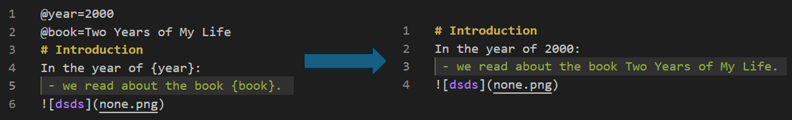
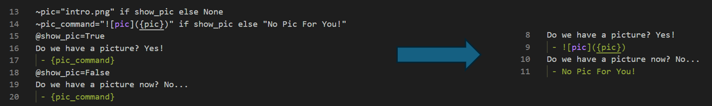

# Markdown Variabled
Custom **markdown** parser/syntax for defining and using variables like **Python format strings**. 

Now supports expressions parsed line-by-line so you can literally do fancy things: 

# Quick Start
You'll only need `parser.py` file. 
## Syntax
 - use the following grammar to define variables on individual new lines:
      - `@var=value` for direct Python variables
      - `~var=expression` for Python expression that will be evaluated upon parsing the line
 - reference your variables in text with brackets {}, just like you'd use an f string in python (`f"the variable is {var}"`):
     - `the variable is {var}`
         - it can also be an expression (like can be defined above): `the variable is {var * var}
 - check `example.md` and `example_parsed.md` for more details. 
## Usage
 - use `python parser.py <markdown file>` on your markdown with above grammar and you get a brand new parsed markdown file `<original_name>_parsed.md` in the same directory by default.
     - check out more options with `python parser.py -h`
## Tips
 - default encoding is utf-8, so multi-lang is supported
     - so if you Python version is high enough, you can do `@开始年份=2018` and `在{开始年份}年时`
 - name your variables like you would name them in Python
     - thus `@what?='what?'` will not work just like `what? = 'what?'` won't work in Python - they are and will be interpreted as Python variables
 - use your variables like in format strings
     - things inside `{}` will be faithfully passed to f-string evaluation function in Python
 - both `@var=value` and `@var = value` work, if you like it neat
     - ~~thanks to Python's strip method~~
- you can even define **functions** using lambda: ~~this is too evil~~
     - e.g. `~format_year=lambda x : str(x) + "年"` and then `{format_year(year)}`
         - sadly you can't use other variables within the lambda function, so you have to pass them in as a parameter (e.g. `lambda x, y: ...`)
         - i.e. `~format_year=lambda x, pre: pre + str(x) + "年"` and `{format_year(year, prefix)}`
### Traps!
- if you want to combine string and some logic code in an expression, make sure you properly surround the strings with quotes, single or double
    - otherwise it's an invalid Python expression
    - e.g. `phrase = 'abc' if some_condition else 'xyz'` is good, but not `phrase = abc if some_condition else xyz`
        - the latter will trigger an exception during evaluation and thus make the parser fallback to treat your expression as a string, use -v flag to see the record if ever confused
- now that Python expressions (*essentially Python codes*) can be run in a markdown file, be aware of fraud and injection attacks! 
     - **don't run the parser on random markdown files people send you** (lol)
         - ~~I mean why don't they run it themselves and send you the parsed version~~

# Packing into Executable Binary
Using `pyinstaller`: 
 - `pip install pyinstaller`
 - `pyinstaller --onefile parser.py`
 - and theoretically you will receive a binary executable on your platform (win, linux, or mac)
     - so you can do `parser.exe <markdown file>` directly
 - an executable binary on Windows (tested on win11) is available and included in the release

# Future Plans
 - maybe a website can be set-up too in the near future. no promises.
 - maybe also available as a PyPI/Conda package, but meh
 - ~~anti-fraud!~~
 - maybe pack a binary or a GUI
     - this is actually more reasonable?
